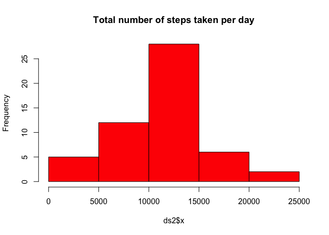
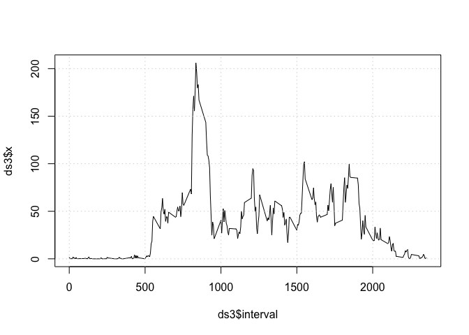
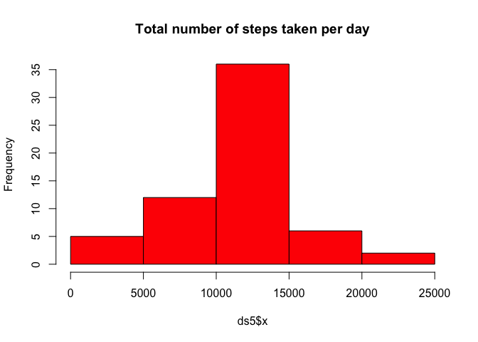
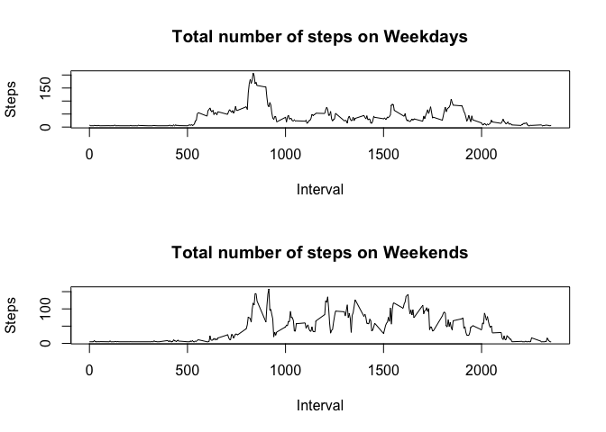

# Reproducible Research - Assignment 1


##Loading the Dataset

First of all, we load the dataset into a variable called dataset and then create a new dataset ignoring the NAs, called ds


```r
dataset <- read.csv('activity.csv')
ds <- na.omit(dataset)
```

##(1) What is mean total number of steps taken per day?
Calculate the total number of steps taken per day


```r
ds2 <- aggregate(ds$steps, by=list(date=ds$date), FUN=sum)
```

#Histogram
Make a histogram of the total number of steps taken each day


```r
hist(ds2$x,col = "red", main = "Total number of steps taken per day")
```

<!-- -->

#Mean and Median
Calculate and report the mean and median of the total number of steps taken per day

Median:

```r
median(ds2$x)
```

```
## [1] 10765
```

Mean:

```r
mean(ds2$x)
```

```
## [1] 10766.19
```

##(2) What is the average daily activity pattern?
Make a time series plot of the 5-minute interval (x-axis) and the average number of steps taken, averaged across all days (y-axis)


```r
ds3 <- aggregate(ds$steps, by=list(interval=ds$interval), FUN=mean)
plot(ds3$interval, ds3$x,type="l")
grid (NULL,NULL)
```

<!-- -->

The max is:


```r
ds3$interval[which.max(ds3$x)]
```

```
## [1] 835
```

##(3) Imputing missing values

Calculate and report the total number of missing values in the dataset


```r
ds4 <- subset(dataset,is.na(dataset$steps))
nrow(ds4)
```

```
## [1] 2304
```

#Replacing NAs in Steps columns with average steps

Create a new dataset that is equal to the original dataset but with the missing data filled in.

Replaced the NA values with the mean of the dataset steps


```r
for(i in 1:nrow(dataset)){
   if (is.na(dataset$steps[i])) {
     dataset$steps[i] <- mean(ds$steps)
   }
}
```

#Total number of steps taken each day

Make a histogram of the total number of steps taken each day


```r
ds5 <- aggregate(dataset$steps, by=list(date=dataset$date), FUN=sum)
hist(ds5$x,col = "red", main = "Total number of steps taken per day")
```

<!-- -->

#Mean and Median

Calculate and report the mean and median of the total number of steps taken per day

Median:

```r
median(ds5$x)
```

```
## [1] 10766.19
```

Mean:

```r
mean(ds5$x)
```

```
## [1] 10766.19
```


##(4) Are there differences in activity patterns between weekdays and weekends?

Create a new factor variable in the dataset with two levels – “weekday” and “weekend” indicating whether a given date is a weekday or weekend day


```r
dataset["day_type"] <- NA
for(i in 1:nrow(dataset)) {
  day <- weekdays(as.Date(dataset$date[i]))
  if (day %in% c("Saturday", "Sunday")) {
    dataset$day_type[i] <- "weekend"
  }
  else {
    dataset$day_type[i] <- "weekday"
  }
}
```

Series plot of 5-minute interval

Make a time series plot of the 5-minute interval (x-axis) and the average number of steps taken, averaged across all days (y-axis)


```r
dataset_wd <- subset(dataset,dataset$day_type == "weekday")
dataset_we <- subset(dataset,dataset$day_type == "weekend")
ds_wd <- aggregate(dataset_wd$steps, by=list(interval=dataset_wd$interval), FUN=mean)
ds_we <- aggregate(dataset_we$steps, by=list(interval=dataset_we$interval), FUN=mean)

par(mfrow=c(2,1))
plot(ds_wd$interval, ds_wd$x,type="l",xlab="Interval", ylab="Steps",main = "Total number of steps on Weekdays")
plot(ds_we$interval, ds_we$x,type="l",xlab="Interval", ylab="Steps",main = "Total number of steps on Weekends")
```

<!-- -->
